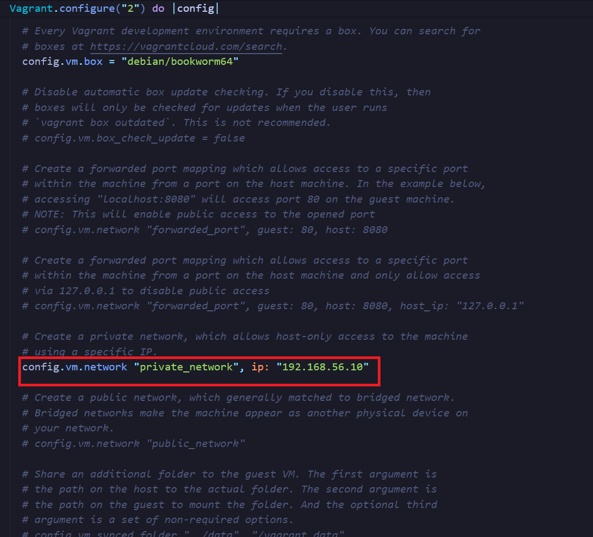

# Workshop 01 – Entorno base con Debian/Bookworm

## Objetivo

Aprovisionar en un equipo de desarrollo un ambiente equiparable al que se encontraría en un servidor GNU/Linux de producción, usando Vagrant y Debian Bookworm.

---

## INSTALACIÓN Y CONFIGURACIÓN INICIAL

1. Se instaló VirtualBox.  
2. Se instaló Vagrant.  
3. Se abrió Git Bash.  
4. Se abrió VirtualBox.  
5. Se fue a Administrador de red (Archivo > Herramientas > Administrador de red) y se verificó que en Host-only Networks hubiera una entrada con una IP asignada.  
6. Recomendación: No tener el escritorio sincronizado con OneDrive, ya que puede generar errores al usar Git Bash.

---

## COMANDOS UTILIZADOS

### Navegación y manejo de directorios

```bash
pwd           Imprime la ruta donde se está trabajando.
mkdir ISW811  Crea el directorio llamado ISW811.
ls            Muestra los archivos que hay en el directorio actual.
ls -la        Muestra los archivos con más detalles (permisos, usuario, etc.).
cd ISW811/    Entra al directorio ISW811.
cd ..         Vuelve al directorio padre.
cd            Va a la carpeta principal del usuario.
```

---

## Estructura de carpetas y comandos utilizados 


Dentro de la carpeta principal `K`, se creó una subcarpeta llamada `VMs` para organizar mejor los proyectos virtualizados.

Para comprobar que las carpetas se crearon correctamente y visualizar su contenido, se realizó un listado detallado.

Posteriormente, dentro de la carpeta `VMs`, se creó otra subcarpeta llamada `WebServer`, donde se alojarán los archivos específicos del servidor web.

Los comandos usados fueron:

```bash
Crear la carpeta principal K
mkdir K

Crear la carpeta VMs dentro de K
mkdir K/VMs

Verificar que la carpeta K contiene la carpeta VMs
ls -la K

Crear la carpeta WebServer dentro de VMs
mkdir K/VMs/WebServer

```
## Manejo de archivos

```bash

Para mover un archivo a una carpeta
mv <archivo> <carpeta_destino>

Para eliminar una carpeta
rm -rf ./private  # (ejemplo de carpeta a eliminar)

```

# Inicialización de VAGRANT

## Paso 1: Inicializar la máquina virtual con Debian

Ejecuta el siguiente comando en la terminal para crear el entorno Vagrant con la caja oficial de Debian Bookworm (64 bits):

```bash
vagrant init debian/bookworm64

```
## Paso 2: Editar el archivo Vagrantfile para configurar la red

Abre el archivo Vagrantfile con tu editor de código. Por ejemplo:

```bash
code Vagrantfile
```
Una vez dentro del archivo:

1. Se descomenta la línea 35 (que usualmente configura la red privada).
2. Se cambia la IP, usando .56 en lugar de .33 y asegurándose de que termine en .10.




## Paso 3: Levantar la máquina virtual

Guarda los cambios y levanta la máquina con:

```bash
vagrant up
```
Esto descargará la caja de Debian (si no está previamente descargada) y configurará la máquina con la IP privada indicada.

## Verificar el estado de la máquina Y COMANDO 

```bash
vagrant status
```

## Verificar conectividad con ping usando la IP configurada (ej. 192.168.56.10) Y COMANDO

```bash
ping 192.168.56.10
```

## Conectarse a la máquina virtual Y COMANDO

```bash
vagrant ssh
```

