## Workshop 03 - Parten 3

**Curso ISW811**

## Función del host y máquina virtual

- Función del host: Gestiona DNS, riesgoso modificar, guardado en PCs.
  
- Invitada: Máquina virtual.
  
- Anfitriona: PC físico.

### Inicio y acceso a Vagrant

1. Iniciar Vagrant: 
   
   ```bash
   cd ~/Desktop/ISW811/K/VMs/webserver
   ```
   
   ```bash
   vagrant up
   ```


2. Acceder a Vagrant:

 ```bash
   vagrant ssh
   ```

   
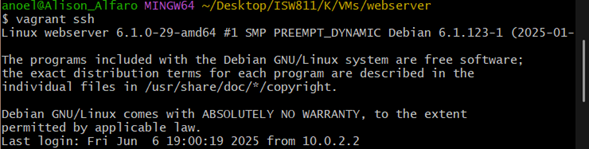


**Conceptos clave**

   - Vhost_alias: Configuración de alias virtual
   - Rewrite: Sobrescribe peticiones.

### Creación de repositorio y commit

1. Crear carpeta y repo:
   
 ```bash
   mkdir workshop03
   ```

 ```bash
  cd workshop03
   ```

```bash
  git init
   ```


2. Agregar y commit:

```bash
  git add .
   ```

```bash
  git commit -m "Inicializar Workshop 03"
   ```

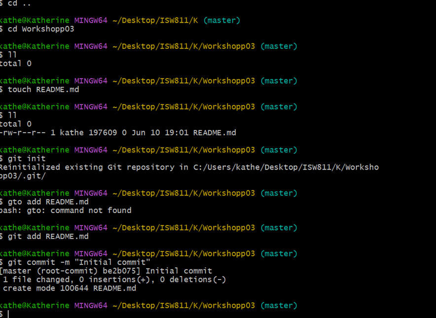

### Verificación de red  

1. Ping a IP:

```bash
 ping 192.168.56.10
   ```

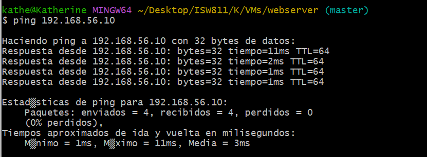


### Creación de sitios y carpetas

1. Crear carpetas en sites:

```bash
 cd /vagrant/sites
   ```

```bash
 mkdir assets images
   ```

```bash
ls -la
   ```

2. Crear archivos:
   
```bash
 mkdir css
   ```

```bash
touch index.html styles.css
   ```

3. Descargar imagen:

```bash
 curl -o images/patitos.jpg https://example.com/patitos.jpg
   ```

4. Abrir VS Code:Abrir proyecto en VS Code.

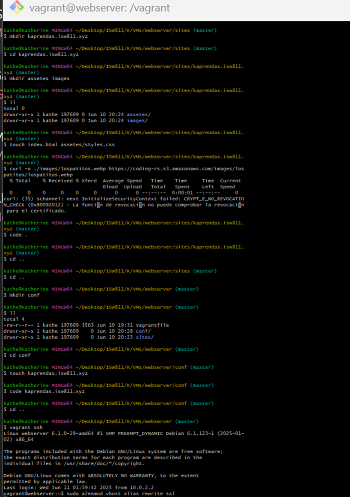

### Código de archivos

1. index.html

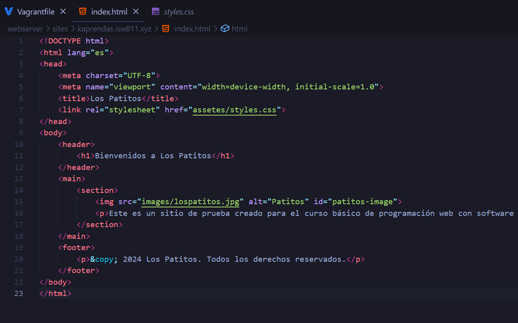

2. styles.css

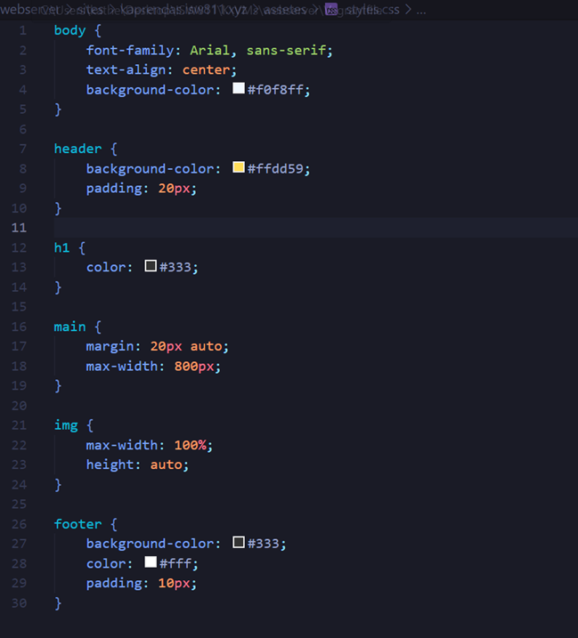


### Configuración de dominio

1. Crear carpeta confs:


```bash
cd /vagrant
   ```
   
```bash
mkdir confs
   ```

```bash
ls -la
   ```

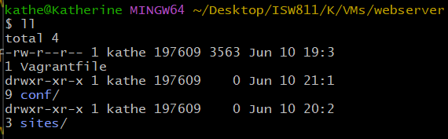

2. Crear archivo de dominio:


```bash
touch confs/kaprendas.isw811.xyz.conf
   ```

3. Copiar configuración:


```bash
sudo cp confs/kaprendas.isw811.xyz.conf
   ```

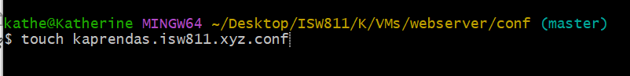

### Verificación y habilitación
 
1. Verificar sintaxis:

```bash
sudo apache2ctl configtest
   ```

2. Habilitar sitio:

```bash
sudo a2ensite kaprendas.isw811.xyz.conf
   ```

3. Reiniciar Apache:

```bash
sudo systemctl restart apache2
   ```

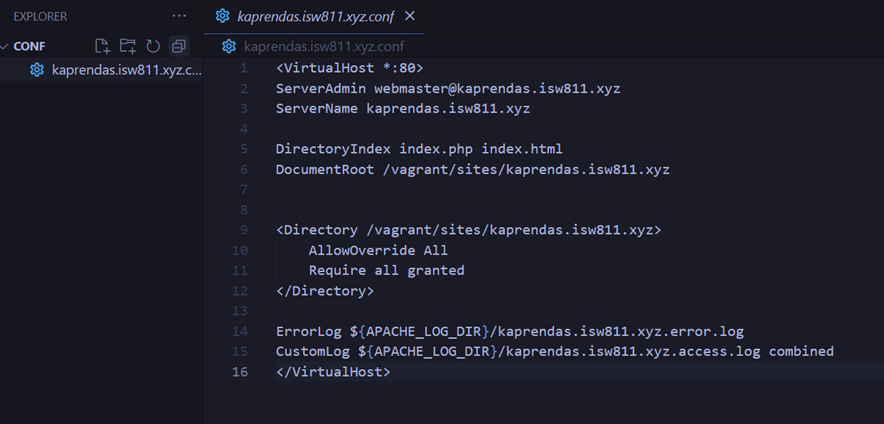

### Estado dentro de la VM

- Estás en /home/vagrant dentro de la VM.
  
- Al hacer cd /vagrant y ls -la, ves:
  
- Archivos y carpetas compartidas desde tu máquina Windows (~/Desktop/ISW811/K/VMs/webserver).
  
- Incluye kaprendas.isw811.xyz.conf (444 bytes, creado el 11/06/2025).
  
- Todo está sincronizado correctamente.
  
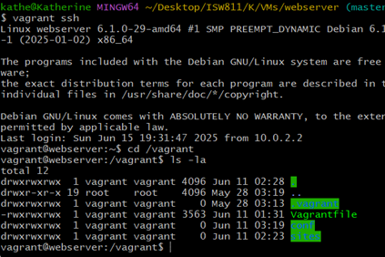

**Notas**
- cd /vagrant: Navega a la raíz compartida.
  
- Sincronización: Archivos como kaprendas.isw811.xyz.conf (444 bytes, creado el 11/06/2025) están sincronizados desde ~/Desktop/ISW811/K/VMs/webserver.

- "|": Tubería para redirigir salida.
 
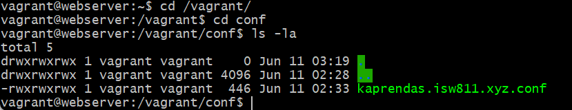


### Verificación de archivo

1. Verificar kaprendas.isw811.xyz.conf:
   
```bash
cd /vagrant/confs
   ```
```bash
ls -la
   ```
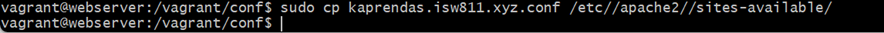


2. Ejecutamos el comando para verificar que no existan errores en syntax 


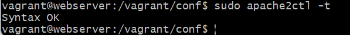

3. Habilitamos el sitio: 

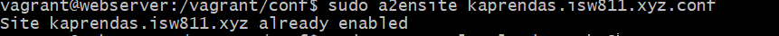

4. Reiniciamos apache 

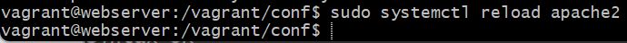


5. Finalmente amos al navegador y buscamos “http://kaprendas.isw811.xyz” y debemos ver algo así: 


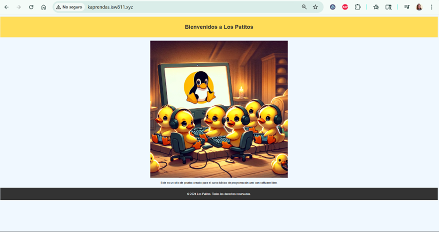


