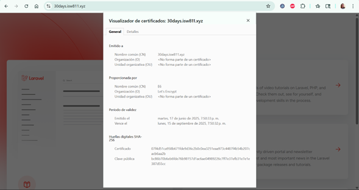

# Taller 04: Configuración de un Entorno de Desarrollo Laravel con Vagrant


## Requisitos Previos
- **Vagrant**: Instalado en la máquina anfitriona.
- **VirtualBox**: U otro proveedor compatible con Vagrant.
- **Editor de Texto**: (por ejemplo, Visual Studio Code) para editar archivos de configuración.
- **Acceso a Terminal**: Para ejecutar comandos en la máquina anfitriona y las máquinas virtuales.
- **Conexión a Internet**: Para descargar dependencias y paquetes.

## Instrucciones Paso a Paso

### 1. Inicializar y Levantar Vagrant
1. **Iniciar la Máquina Virtual de Vagrant**:
   - Ejecuta el siguiente comando en la terminal para inicializar y levantar la máquina virtual:
     ```bash
     vagrant up
     ```

2. **Editar el Vagrantfile**:
   - Abre el archivo `Vagrantfile` en el directorio del proyecto.
   - Modifica la línea 47 para ajustar la configuración de la máquina virtual (por ejemplo, configuración de red, carpetas sincronizadas o nombre de la VM).
   - Guarda los cambios.

3. **Verificar Cambios en el Vagrantfile**:
   - Asegúrate de que las modificaciones en el `Vagrantfile` se aplicaron correctamente revisando la configuración de la VM o reiniciándola:
     ```bash
     vagrant reload
     ```

### 2. Instalar y Verificar Tree
1. **Instalar la Utilidad `tree`**:
   - Accede a la máquina virtual de Vagrant vía SSH:
     ```bash
     vagrant ssh
     ```

   - Instala el paquete `tree` para visualizar la estructura de directorios:
     ```bash
     sudo apt-get update
     sudo apt-get install tree
     ```

2. **Verificar Instalación de `tree`**:
   - Ejecuta el siguiente comando para mostrar la estructura del directorio actual:
     ```bash
     tree .
     ```

### 3. Instalar y Configurar Composer
1. **Instalar Composer**:
   - En el directorio home de la máquina virtual, descarga e instala Composer:
     ```bash
     curl -sS https://getcomposer.org/installer | php
     ```
   - Verifica que el archivo `composer.phar` exista:
     ```bash
     ls -l composer.phar
     ```

2. **Crear Directorio para Composer**:
   - Crea un directorio para Composer en `/opt`:
     ```bash
     sudo mkdir /opt/composer
     ```
   - Mueve el archivo `composer.phar` al directorio creado:
     ```bash
     sudo mv composer.phar /opt/composer/
     ```

3. **Crear un Enlace Simbólico**:
   - Crea un enlace simbólico para que Composer sea accesible globalmente:
     ```bash
     sudo ln -s /opt/composer/composer.phar /usr/local/bin/composer
     ```

4. **Verificar Instalación de Composer**:
   - Comprueba la versión de Composer:
     ```bash
     composer --version
     ```
   - Localiza el binario de Composer:
     ```bash
     which composer
     ```

### 4. Configurar Proyecto Laravel
1. **Navegar al Directorio Sites**:
   - Dirígete al directorio `/vagrant/sites` (o la carpeta sincronizada correspondiente):
     ```bash
     cd /vagrant/sites
     ```

2. **Crear un Proyecto Laravel**:
   - Usa Composer para crear un nuevo proyecto Laravel llamado `30days.isw811.xyz`:
     ```bash
     composer create-project --prefer-dist laravel/laravel 30days.isw811.xyz
     ```

3. **Ajustar Timeout de Composer**:
   - Para evitar errores de timeout durante operaciones de Composer, establece un tiempo de espera mayor:
     ```bash
     export COMPOSER_PROCESS_TIMEOUT=600
     ```

### 5. Configurar Apache
1. **Copiar Configuración de Apache**:
   - Copia el archivo de configuración predeterminado de Apache para crear una nueva configuración de sitio:
     ```bash
     sudo cp /etc/apache2/sites-available/000-default.conf /etc/apache2/sites-available/30days.isw811.xyz.conf
     ```

2. **Editar el Archivo de Configuración**:
   - Abre el archivo `30days.isw811.xyz.conf` en un editor de texto (por ejemplo, `nano` o Visual Studio Code):
     ```bash
     sudo nano /etc/apache2/sites-available/30days.isw811.xyz.conf
     ```
   - Actualiza la configuración para que apunte al directorio `public` del proyecto Laravel. Ejemplo de configuración:
     ```apache
     <VirtualHost *:80>
         ServerName 30days.isw811.xyz
         DocumentRoot /vagrant/sites/30days.isw811.xyz/public
         <Directory /vagrant/sites/30days.isw811.xyz/public>
             AllowOverride All
             Require all granted
         </Directory>
     </VirtualHost>
     ```

3. **Habilitar el Sitio**:
   - Habilita la nueva configuración del sitio:
     ```bash
     sudo a2ensite 30days.isw811.xyz.conf
     ```

4. **Verificar Sintaxis y Reiniciar Apache**:
   - Comprueba la sintaxis de los archivos de configuración:
     ```bash
     sudo apache2ctl configtest
     ```
   - Reinicia el servicio de Apache para aplicar los cambios:
     ```bash
     sudo systemctl restart apache2
     ```

### 6. Configurar el Archivo Hosts en la Máquina Anfitriona
1. **Editar el Archivo Hosts**:
   - En la máquina anfitriona, abre el archivo `hosts` (en `/etc/hosts` en Linux/Mac o `C:\Windows\System32\drivers\etc\hosts` en Windows).
   - Añade la siguiente línea para mapear el dominio al IP de la máquina virtual (sustituye `192.168.33.10` por el IP configurado en el Vagrantfile):
     ```text
     192.168.33.10 30days.isw811.xyz
     ```

2. **Verificar en el Navegador**:
   - Abre un navegador en la máquina anfitriona y accede a `http://30days.isw811.xyz`.
   - Es posible que veas un error (por ejemplo, un error de Laravel o de conexión), lo cual es esperado en esta etapa.

### 7. Configurar el Archivo .env de Laravel
1. **Editar el Archivo .env**:
   - Navega al directorio del proyecto Laravel:
     ```bash
     cd /vagrant/sites/30days.isw811.xyz
     ```
   - Abre el archivo `.env` en un editor de texto:
     ```bash
     nano .env
     ```
   - Descomenta las líneas de la 25 a la 29 (generalmente relacionadas con la configuración de la base de datos, como `DB_HOST`, `DB_DATABASE`, `DB_USERNAME`, `DB_PASSWORD`).

### 8. Configurar la Máquina Virtual de la Base de Datos
1. **Crear una Nueva Máquina Virtual**:
   - Crea un nuevo directorio para la máquina virtual de la base de datos:
     ```bash
     mkdir database && cd database
     ```
   - Inicializa un nuevo Vagrantfile:
     ```bash
     vagrant init
     ```

2. **Editar el Vagrantfile**:
   - Abre el `Vagrantfile` y modifica la línea 35 para configurar la máquina (por ejemplo, el nombre o la red).
   - Cambia el nombre de la máquina de `bookworm` a `database`.

3. **Levantar la Máquina Virtual**:
   - Inicia la máquina virtual:
     ```bash
     vagrant up
     ```
   - Accede a la máquina virtual vía SSH:
     ```bash
     vagrant ssh
     ```

4. **Instalar MariaDB**:
   - Actualiza los paquetes:
     ```bash
     sudo apt-get update
     ```
   - Instala el servidor y cliente de MariaDB:
     ```bash
     sudo apt-get install mariadb-server mariadb-client
     ```
   - Habilita el acceso remoto editando la configuración de MariaDB (por ejemplo, `/etc/mysql/mariadb.conf.d/50-server.cnf`):
     ```bash
     sudo nano /etc/mysql/mariadb.conf.d/50-server.cnf
     ```
     - Cambia `bind-address` a `0.0.0.0` para permitir conexiones remotas.
   - Reinicia el servicio de MariaDB:
     ```bash
     sudo systemctl restart mariadb
     ```

5. **Configurar la Base de Datos**:
   - Accede a MariaDB:
     ```bash
     sudo mysql
     ```
   - Crea una base de datos:
     ```sql
     CREATE DATABASE laravel;
     ```
   - Crea un usuario para Laravel:
     ```sql
     CREATE USER 'laravel'@'%' IDENTIFIED BY 'password';
     ```
   - Otorga permisos al usuario:
     ```sql
     GRANT ALL PRIVILEGES ON laravel.* TO 'laravel'@'%';
     ```
   - Aplica los privilegios:
     ```sql
     FLUSH PRIVILEGES;
     ```

### 9. Configurar la Máquina Virtual del Servidor Web
1. **Levantar la Máquina Virtual del Servidor Web**:
   - En otra terminal, navega al directorio de la máquina virtual `webserver` y levántala:
     ```bash
     cd webserver
     vagrant up
     vagrant ssh
     ```

2. **Desinstalar MariaDB**:
   - Si MariaDB está instalado en la máquina del servidor web, elimínalo:
     ```bash
     sudo apt-get remove --purge mariadb-server mariadb-client
     ```

3. **Configurar Conexión a la Base de Datos**:
   - Modifica el archivo `.env` del proyecto Laravel en `/vagrant/sites/30days.isw811.xyz` para apuntar a la IP de la máquina virtual de la base de datos (por ejemplo, `DB_HOST=192.168.33.11`).

4. **Verificar en el Navegador**:
   - Refresca el navegador en `http://30days.isw811.xyz`. Si aparece un error, es esperado en esta etapa.

### 10. Configurar Certificados SSL
1. **Copiar y Descomprimir Certificado**:
   - Copia el archivo del certificado SSL al directorio del servidor web (por ejemplo, `/vagrant/certs`).
   - Descomprime el archivo:
     ```bash
     unzip certificate.zip -d /vagrant/certs
     ```

2. **Crear Nueva Configuración SSL**:
   - Copia el archivo de configuración existente para crear una versión SSL:
     ```bash
     sudo cp /etc/apache2/sites-available/30days.isw811.xyz.conf /etc/apache2/sites-available/30days.isw811.xyz-ssl.conf
     ```

3. **Editar Configuración SSL**:
   - Abre el archivo `30days.isw811.xyz-ssl.conf`:
     ```bash
     sudo nano /etc/apache2/sites-available/30days.isw811.xyz-ssl.conf
     ```
   - Configura el sitio para usar HTTPS. Ejemplo:
     ```apache
     <VirtualHost *:443>
         ServerName 30days.isw811.xyz
         DocumentRoot /vagrant/sites/30days.isw811.xyz/public
         SSLEngine on
         SSLCertificateFile /vagrant/certs/certificate.crt
         SSLCertificateKeyFile /vagrant/certs/private.key
         <Directory /vagrant/sites/30days.isw811.xyz/public>
             AllowOverride All
             Require all granted
         </Directory>
     </VirtualHost>
     ```

4. **Modificar Configuración HTTP**:
   - Edita `30days.isw811.xyz.conf` para redirigir HTTP a HTTPS:
     ```apache
     <VirtualHost *:80>
         ServerName 30days.isw811.xyz
         Redirect permanent / https://30days.isw811.xyz/
     </VirtualHost>
     ```

5. **Habilitar Módulo SSL y Sitio**:
   - Habilita el módulo SSL de Apache:
     ```bash
     sudo a2enmod ssl
     ```
   - Habilita el sitio SSL:
     ```bash
     sudo a2ensite 30days.isw811.xyz-ssl.conf
     ```
   - Reinicia Apache:
     ```bash
     sudo systemctl restart apache2
     ```

6. **Verificar Certificado**:
   - Accede a `https://30days.isw811.xyz` en el navegador y verifica que el certificado esté correctamente instalado (busca el icono de candado en la barra de direcciones).
  
       


## Comandos Útiles
- **Eliminar un Directorio**:
  ```bash
  rm -rf directorio
  ```
- **Eliminar un Archivo**:
  ```bash
  rm archivo
  ```
- **Verificar Ubicación de un Binario**:
  ```bash
  which nombre_programa
  ```


